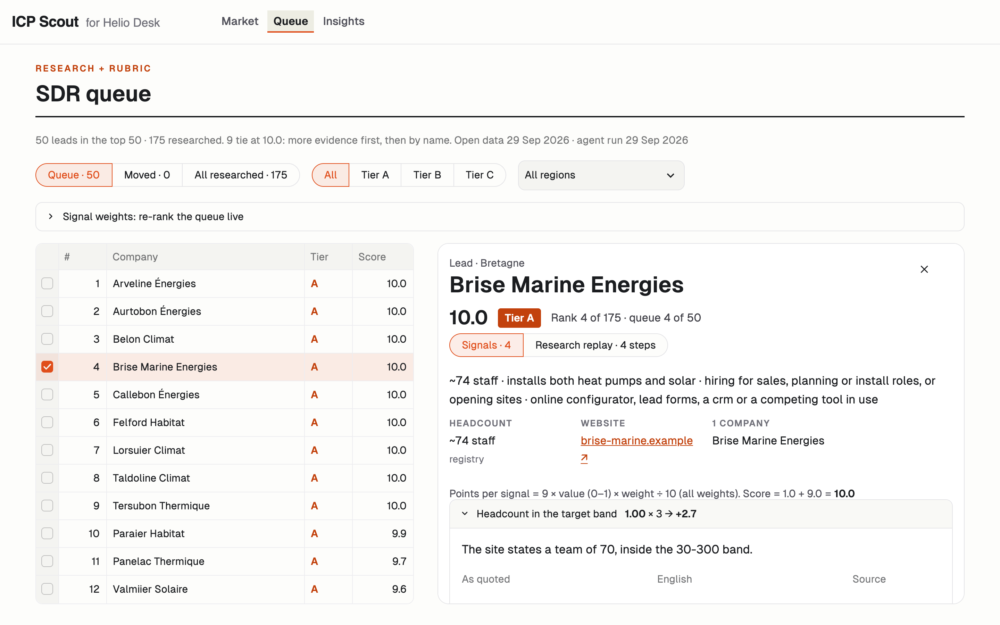
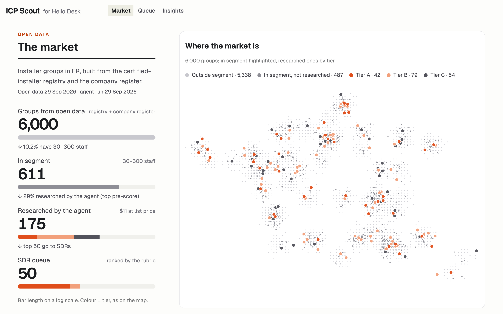

# icp-scout

icp-scout maps a whole market from open data, researches a shortlist with an AI agent, scores it with a rubric you can read, and hands SDRs a ranked queue.

[](https://github.com/LennSchneidewind-67548/icp-scout/actions/workflows/ci.yml)


*Built as a take-home case for a GTM engineering role. The case company stays private; the example config targets a fictional vendor.*

Everything specific to a vendor (market, segment, reference customers, signals and their weights) lives in one YAML file, so pointing it at another ICP is a config change, not a code change. The example config targets heat-pump and solar installers in France for a fictional software vendor.

## What it does

Six stages. The cost of each is what decides where the model is used.

1. **Source** (`icp-scout source`). Pulls every certified installer from open registries, joins company data, and rolls sister companies up to groups. No LLM.
2. **Pre-filter** (`icp-scout funnel` shows the result). Rule-based segment checks and a pre-score for the whole market, with the reason for every exclusion. No LLM.
3. **Research** (`icp-scout research`, then `regrade`). The agent runs only on the shortlist. It extracts signals with quoted evidence, and it never outputs a score.
4. **Score** (`icp-scout score`). Arithmetic on the agent's signals: weights from the config, `1 + 9 × weighted mean`, tiers A/B/C. No LLM.
5. **Insights** (`icp-scout insights`). The patterns across the market and the shortlist, as tables and chart specs.
6. **Hand-off** (`icp-scout export`). A HubSpot import and one drafted opener per lead. One model call per lead.

`icp-scout cost` reports what the model calls cost.

## The demo

The demo runs on synthetic data and fictional companies. No API key is needed.



*The SDR queue with a lead open. Synthetic data, fictional companies.*



*The market page: where the companies are, and how the market narrows to the queue. Synthetic data, fictional companies.*

Things to try: open a lead and read the evidence behind its score; step through the research replay (the three recorded leads have one); move a weight and watch the queue re-rank.

## Design choices

- **The whole market, not a list** ([ADR 0001](docs/decisions/0001-open-data-over-scraping.md)). Public registries give every certified installer, so the patterns are about the market and the agent only spends money on the shortlist. The limit: this carries over to another country only where a comparable open registry exists.
- **The model extracts, the rubric scores** ([ADR 0002](docs/decisions/0002-hybrid-scoring.md)). Every score comes from signals with quoted evidence and weights anyone can change.
- **Case-company content is never committed** ([ADR 0003](docs/decisions/0003-case-company-content-never-committed.md)). A script checks all of git history against a private list of terms.
- **Patterns, not code, from earlier work** ([ADR 0004](docs/decisions/0004-patterns-not-code-from-outreach-engine.md)).
- **It states what it costs.** Every model call goes to a cost ledger; `icp-scout cost` reports the cost per researched lead.
- **It drafts, people send.** Nothing is sent to anyone.

## Run it

Install on macOS or Linux:

```sh
python -m venv .venv && source .venv/bin/activate
pip install -e ".[dev]"
pytest
```

On Windows with Git Bash, activate with `source .venv/Scripts/activate` instead.

### The example demo

```sh
python fixtures/demo/make_demo.py
ICP_SCOUT_CONFIG=config/icp.example.yaml ICP_SCOUT_DATA=data/example \
ICP_SCOUT_RECORDINGS=fixtures/llm streamlit run app/streamlit_app.py
```

The first command writes a synthetic market to `data/example/`. The three variables are all set so a local `.env` can't point the demo at other data.

### The real pipeline

```sh
icp-scout show-config
icp-scout source       # data/companies.parquet, data/market.parquet, data/funnel.json; HTTP cached in data/cache/
icp-scout funnel       # prints the funnel of the last source run
icp-scout research     # data/research/, data/signals.parquet, the cost ledger data/ledger.jsonl
icp-scout regrade      # finer grades on the recorded evidence, no new research
icp-scout score        # data/scored.parquet and the queue
icp-scout insights     # data/insights/
icp-scout export       # data/export/: HubSpot CSVs and the openers
icp-scout cost
```

`research`, `regrade` and `export` need `ANTHROPIC_API_KEY` or a logged-in `claude` CLI (`research.backend: claude-code` in the config). Each records its answers under `fixtures/llm/`, so a re-run replays them. To use your own ICP, copy `config/icp.example.yaml` and set `ICP_SCOUT_CONFIG` to the copy.

## How it was built

With Claude Code, as a workflow in which I make the calls: planning interviews, one work package per session, review before merge. The [build log](docs/build-log.md) records each session: what the agent proposed, and what I decided or caught. The work packages are planned in [`docs/wp/`](docs/wp/). The ADR 0003 leak check ([`scripts/leak-check.sh`](scripts/leak-check.sh)) runs in CI over all of git history and kept the case company out of it.

In numbers: about 12 hours of my time to the presentation, 24 agent sessions, about $0.17 to $0.22 per researched lead, 147 tests.

## Repo map

```
src/icp_scout/   the pipeline: sourcing, research, scoring, insights, export
app/             the Streamlit demo
config/          the ICP config (an example for a fictional vendor)
fixtures/        source fixtures, recorded model answers, the demo data generator
tests/
docs/            requirements, plan, decisions, build log, case study (index: docs/README.md)
scripts/         the leak check
```

The docs have their own index: [docs/README.md](docs/README.md). A longer write-up is in [docs/case-study.md](docs/case-study.md).

## License

MIT
