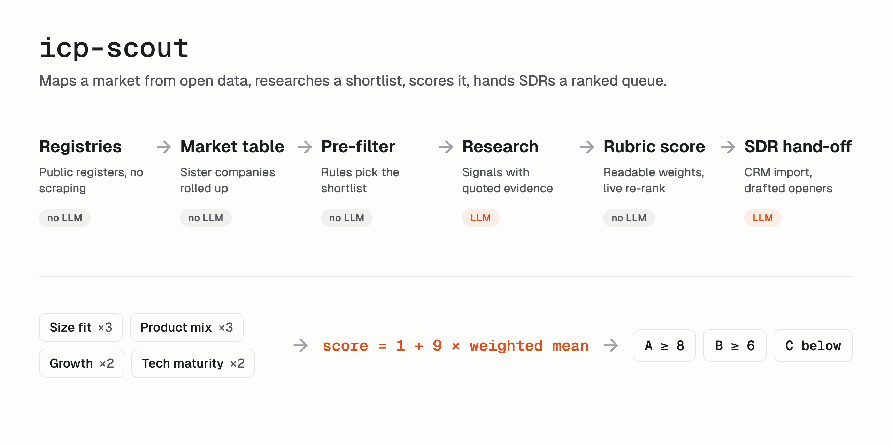

# Case study: scoring a market for an SDR team

I built icp-scout as a take-home case for a GTM engineering role. This is what the problem was, how I approached it, and what I took from it. The case company stays private, so the examples here come from a fictional vendor.

## The problem

The brief asked for four things. Source 50 target companies for a B2B software vendor, in one country and one segment. Score each from 1 to 10, with logic that can be explained. Present the patterns to leadership. Sketch an outbound process an SDR team could scale.

I read it as two problems. The list of 50 is the visible one. The harder one is how someone would get a fifty-first, or do the same for another vendor next quarter. So I built a tool rather than a list, and the vendor-specific parts went into one config file.

## The approach

The pipeline has six stages, shown in the [README](../README.md):

1. I source the whole market from open registries, not a purchased list ([ADR 0001](decisions/0001-open-data-over-scraping.md)).
2. A rule-based pre-filter shrinks it to a shortlist. No model is involved.
3. An agent researches each shortlisted company and extracts signals, each with a quote as evidence.
4. A rubric in code turns the signals into a score ([ADR 0002](decisions/0002-hybrid-scoring.md)).
5. The patterns across the market become the insights for leadership.
6. The hand-off produces a CRM import and a drafted opener per lead. People send; the tool doesn't.

The money goes where it matters. Stages 1, 2 and 4 cost nothing per lead. The agent runs only on the shortlist.

## What I learned

**Start from the whole market, not a list.** A list tells you about the 50 names on it. The whole market tells you where the rest are, which regions are crowded, and what separates a good lead from a poor one. That is the material for the leadership presentation. It also keeps the agent's budget honest, because research is the one expensive stage and it only sees the shortlist. The limit is that this needs an open registry. It carries over to another country only where a comparable one exists.

**Let the model extract and the code score.** The agent reads the web and reports what it finds: a signal, a grade, a quote. It never outputs the score. That makes every score checkable, because you can open a lead and read the evidence. It also turns the weights into a business conversation. In the demo you move a weight and the queue re-ranks with no model call. Someone who disagrees with the rubric can change it without arguing about a prompt.

**Real company structure matters.** Many installers turned out to be sisters inside one group, each small on paper. Judged one by one, they fall under the size filter. Rolled up to the group, some qualify. I had to join companies on shared managers, addresses and websites before the size filter ran. Skipping that step would have dropped real targets without any error showing.

**Small firms have a thin web presence, and that drives the cost.** I expected the model to be the main cost. For small companies the agent searches and fetches a lot to find anything, and the search and fetch calls cost more than the tokens. Measuring a pilot on the real API gave me a cost per researched lead I could state in the write-up. That figure is the one the whole approach depends on, so I measured it early.

**A rubric can saturate.** After the first full run, the top of the list had many leads at the maximum on every signal, with more of them than the queue had places. Weights can't separate leads that tie on every signal, so the cut fell inside a tie and the order was decided by the pre-score, which didn't predict the agent's result. The fix was finer grades per signal, applied to the evidence I had already recorded. That separated the top without any new research. The lesson is to check how many distinct scores the rubric produces before trusting its ranking.

**Record every model answer.** Each call is saved. The demo runs offline, CI needs no API key, re-scoring costs nothing, and the research replay in the demo lets a viewer step through what the agent did. Recording also made the work reviewable. A prompt change shows up as a recording that no longer matches.

**Building with an agent means reviewing it.** I used Claude Code for most of the build, and the [build log](build-log.md) records each session. The agent is fast and often right, and the useful part of my role was review. A few examples from the log. The agent's first draft of the project instructions named the case company, and I caught it before the first commit; that is why the leak check exists ([ADR 0003](decisions/0003-case-company-content-never-committed.md)). The agent wrote a spending budget into a private config that I had never agreed to, and I corrected it. In the other direction, the agent noticed that its first research run had graded undated job-board ads as current hiring, against its own scale. We reran with clearer wording and I kept the strict rule. Neither side caught everything, and the log is where that shows.

## What I'd do next

- **An n8n workflow** around the pipeline. I left it out for time and named it as the next step.
- **CRM sync beyond the CSV import**, so owners and outcomes flow back into the scores.
- **Triggers that re-score a lead**, such as a new certification or new job posts.
- **A small hand-labelled accuracy set.** I report the cost per lead, but I never measured accuracy. A few dozen leads labelled by a person would show how often the signals are right.
- **Registries in other countries**, to test whether the sourcing approach holds outside the first one.

## How it was built

Planning interviews, one work package per session, and a review before every merge. About 12 hours of my time to the presentation, 24 agent sessions, about $0.17 to $0.22 per researched lead, and 147 tests. The [build log](build-log.md) has the sessions and the [work package plans](wp/) have the detail. The leak check ([`scripts/leak-check.sh`](../scripts/leak-check.sh)) runs in CI over the whole history and kept the case company out of it.
